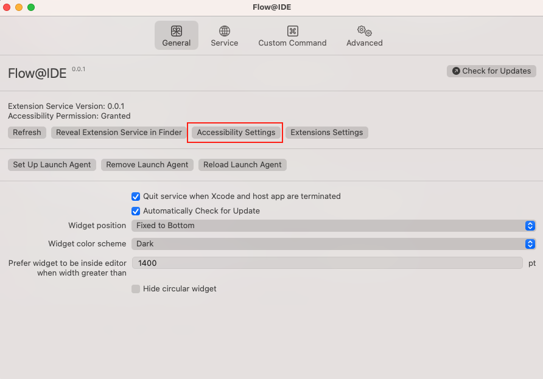
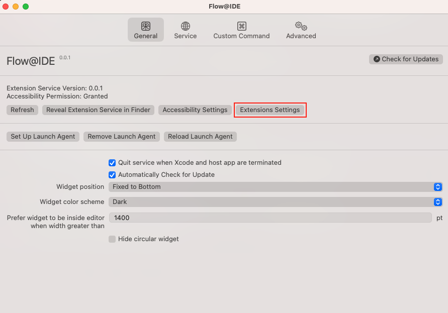
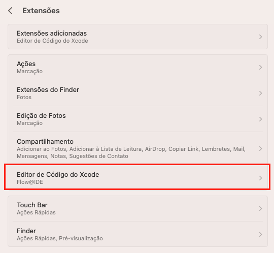

## Step 1: Delete CopilotForXcode if it is already installed

If you have already installed Copilot for Xcode, you must uninstall it before installing Flow@IDE and Flow-Auth.

## Step 2: Initial Settings

1 - To perform the initial settings, on the application's main screen there are two buttons that will take you to the macOS settings. The first one will take you to the accessibility setting.

Then you must enable the Flow@IDEExtensionService.

2 - The second button will take you to Xcode extensions setting.

Select the cell containing the text **Xcode Code Editor**.

And enable the extension.

## Step 3: Authenticate the Flow@IDE

Open the Flow@IDE application.

1 - In the top center of the screen, click on the button with the text **Service**.

2 - On another screen, click on the button with the text **CI&T/Flow** on the left side of the screen. This will display the rest of the information on this screen.

3 - In the rest of the information on the screen there is a button with the text **CI&T/Flow Login**. Click on it to open the **Flow-Auth** authentication screen.

***Congratulations! You have now successfully installed the plugin Xcode.***