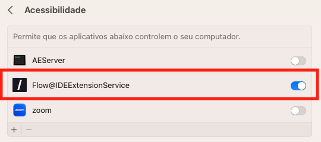

## Step 1: Delete CopilotForXcode if it is already installed

If you have already installed Copilot for Xcode, you must uninstall it before installing Flow@IDE and Flow-Auth.

## Step 2: Initial Settings

1 - Go to your computer settings and click on **Security & Privacy**. Give Flow@IDE permissions for the Accessibility API.

2 - Still in **Security & Privacy**, in extensions, add Flow@IDE as the Xcode code editor.

## Step 3: Open Flow@IDE

Open the Flow@IDE application.

1 - In the top center of the screen, click on the button with the text **Service**.

2 - On another screen, click on the button with the text **CI&T/Flow** on the left side of the screen. This will display the rest of the information on this screen.

3 - In the rest of the information on the screen there is a button with the text **CI&T/Flow Login**. Click on it to open the **Flow-Auth** authentication screen.

***Congratulations! You have now successfully installed the plugin Xcode.***